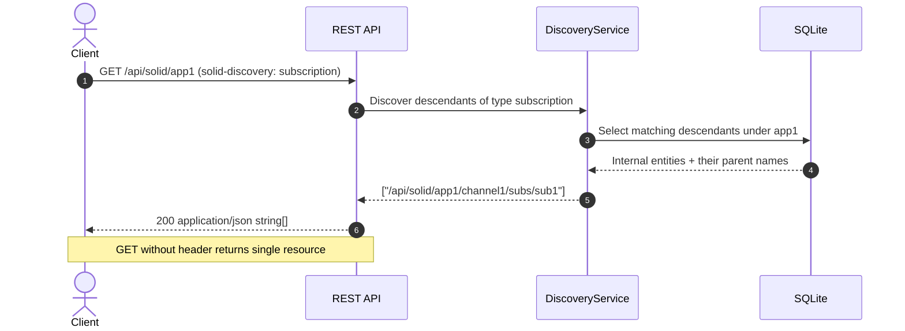

# Sequência de descoberta

> **Modelo proposto**, não implementação concluída.

```mermaid
sequenceDiagram
    autonumber
    actor Client
    participant API as REST API
    participant Discovery as DiscoveryService
    participant DB as SQLite
    Client->>API: GET /api/solid/app1 (solid-discovery: subscription)
    API->>Discovery: Discover descendants of type subscription
    Discovery->>DB: Select matching descendants under app1
    DB-->>Discovery: Internal entities + their parent names
    Discovery-->>API: ["/api/solid/app1/channel1/subs/sub1"]
    API-->>Client: 200 application/json string[]
    Note over API,Client: GET without header returns single resource
```

A operação de descoberta não devolve entidades nem IDs SQLite: devolve **caminhos de recurso** em JSON.
